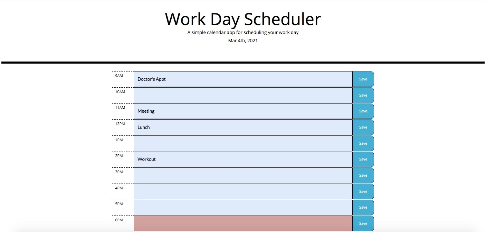

# day-planner

I used Jquery, Bootstrap, and moment to create an interactive day planner.

When the user types into the text area and clicks the save button for each hour their input is saved in local storage.

That Info is render when the page is loaded so that their previous inputs are seen when they come back to the page. 

Depending on the current hour of the day each time block is color coded.

# Links
Deployed:
https://cmorris91.github.io/day-planner/
Repo:
https://github.com/cmorris91/day-planner

#Photos

`